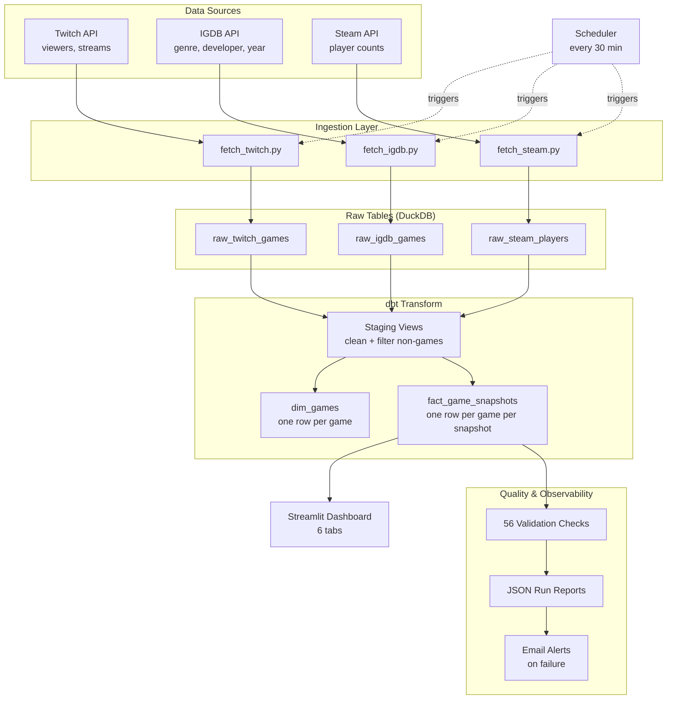

# Game Pulse


A data engineering pipeline that tracks game popularity over time using Twitch, IGDB, and Steam data. Collects snapshots every 30 minutes, transforms them with dbt and serves a live analytics dashboard.

Built as a learning project to understand real data engineering - ingestion, transformation, orchestration, validation, storage, and visualization.

## Architecture



### Screenshots


## Quick Start

### Prerequisites

- Python 3.10+
- Git
- A Twitch Developer account (for API credentials)

### 1. Clone and install

```bash
git clone <repo-url>
cd game-data-pipeline
python -m venv venv
venv\Scripts\activate          # Windows
# source venv/bin/activate     # Mac/Linux
pip install -r requirements.txt
```

### 2. Set up credentials

Create a `.env` file in the project root:

```
TWITCH_CLIENT_ID=your_client_id
TWITCH_CLIENT_SECRET=your_client_secret
```

Get these from https://dev.twitch.tv/console/apps. These same credentials work for both Twitch and IGDB APIs (IGDB is owned by Twitch).

### 3. Test everything works

```bash
make test              # runs full test suite (config, ingest, dbt, validation)
```

Or without make:

```bash
python -m tests.test_pipeline --test full
```

### 4. Start the pipeline + dashboard

```bash
make start             # launches pipeline (every 30 min) + dashboard together
```

Or without make:

```bash
python pipelines/pipeline.py --serve    # in one terminal
streamlit run dashboard/app.py          # in another terminal
```

The dashboard opens at http://localhost:8501. The pipeline runs immediately, then every 30 minutes. Press Ctrl+C to stop.

### Alternative: Docker

```bash
docker-compose up
```

No Python install needed. Runs pipeline + dashboard, persists data between restarts.

## All Commands

| Command | What it does |
|---------|-------------|
| `make start` | Launch pipeline scheduler + dashboard together |
| `make run` | Run pipeline once |
| `make test` | Full test suite (~2 min) |
| `make test-smoke` | Quick smoke test (~30s) |
| `make test-fresh` | First-run test (wipes DB, runs from scratch, restores) |
| `make validate` | Run 56 data quality checks on existing data |
| `make dashboard` | Launch dashboard only |
| `make reset` | Wipe database + logs for fresh start |
| `make db-counts` | Show row counts per table |
| `make logs` | Show last 50 lines of pipeline log |

To install `make` on Windows: `choco install make` (run as admin). If you don't have make, open the Makefile and run the commands under each target directly.

## Project Structure

```
game-data-pipeline/
  ingest/              # API ingestion (Twitch, IGDB, Steam)
  game_pulse/models/   # dbt transformations (staging + marts)
  pipelines/           # Prefect orchestration
  dashboard/           # Streamlit analytics dashboard (6 tabs)
  tests/               # Test suite + 56 validation checks
  maintenance/         # Hot/cold storage archival
  logs/runs/           # JSON run reports (one per pipeline execution)
  data/                # DuckDB database + Parquet archives
  docs/                # Architecture guide + portfolio roadmap
```

## Dashboard

The dashboard has 6 tabs:

| Tab | What it shows |
|-----|--------------|
| Overview | Top 10 games bar chart, KPI cards, rank movement |
| Movers | Biggest gainers/losers, volatility scatter plot |
| Trends | Multi-game comparison, engagement density (detects "one streamer carries a game") |
| Genres | Market share donut, genre trends over time |
| Deep Dive | Single game: dual-axis chart, rank history, momentum |
| Pipeline | Data freshness, run history, validation results, database health |


## Tech Stack

| Tool | Purpose |
|------|---------|
| DuckDB | Embedded analytical database |
| dbt | SQL transformations (staging + marts) |
| Prefect | Task orchestration with retries and timeouts |
| Streamlit | Analytics dashboard |
| Plotly | Interactive charts |
| Twitch API | Live game popularity data |
| IGDB API | Game metadata (genre, developer, release year) |
| Steam API | Concurrent player counts |
